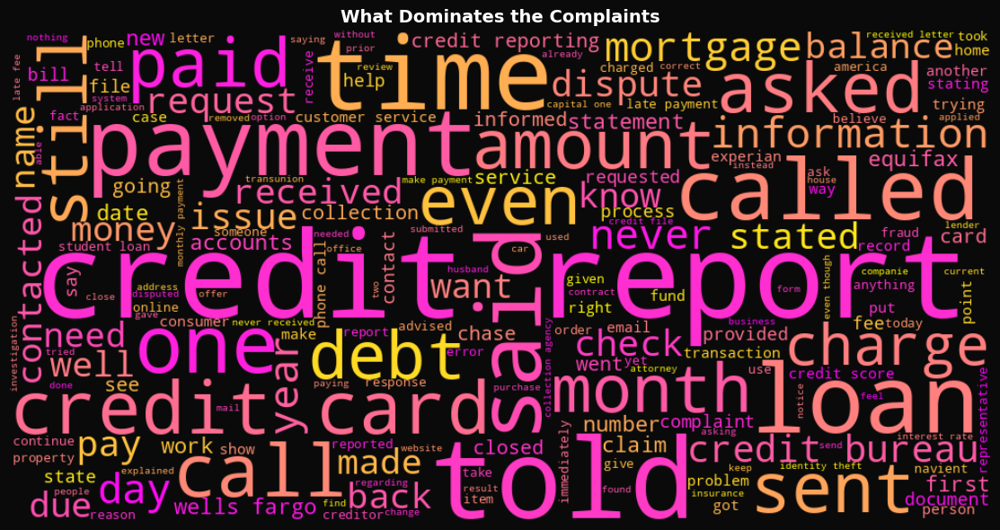
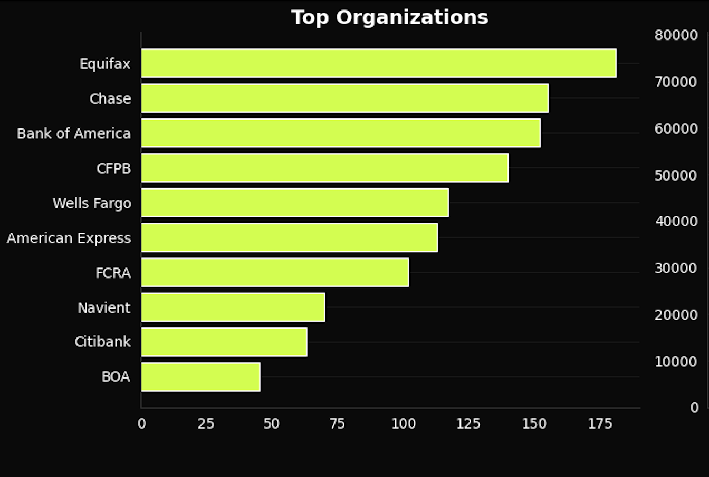
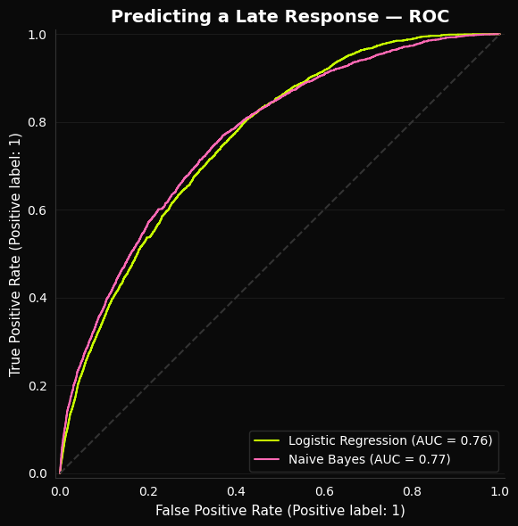
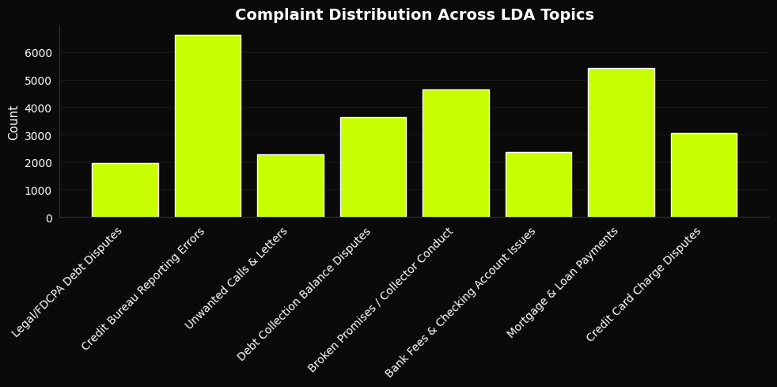
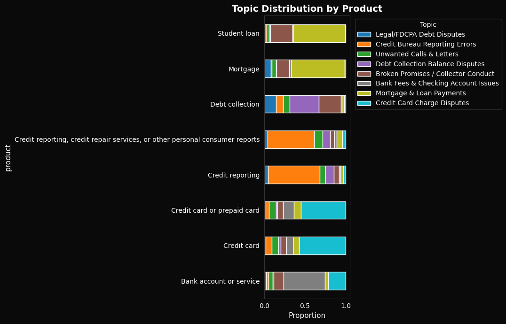
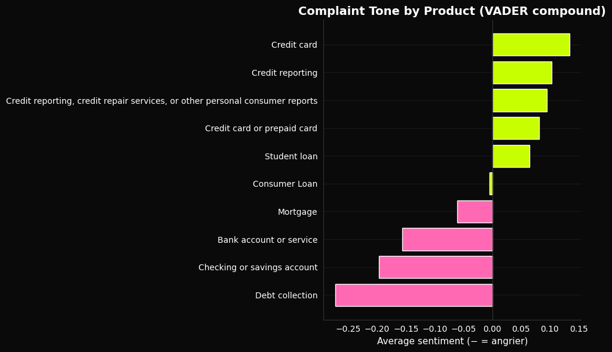
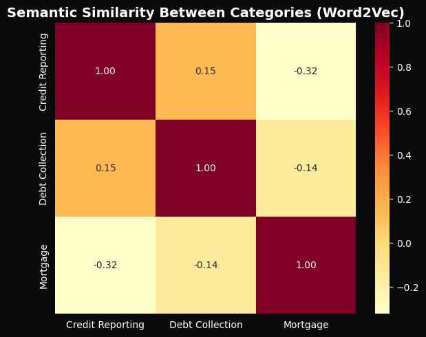

# What Do 383,000 Financial Complaints Reveal?

**LDA Topic Modeling · Logistic Regression · Word2Vec · NLP Pipeline · 383,564 Narratives**

---

## Overview

Banks, credit bureaus, and lenders receive millions of consumer complaints every year — but the richest signal is buried in free-text narratives that structured data alone cannot capture. This project applied an end-to-end NLP pipeline to the CFPB public complaint database to surface systemic patterns, predict which companies will fail to respond on time, and identify what people are actually complaining about.

> Full write-up: https://jasminebahremand.my.canva.site/

---

## Key Findings

- **Complaint text predicts untimely responses at ROC-AUC 0.76** (time-ordered split) — catching 63% of at-risk cases before a deadline passes
- **The predictive signal is entity-driven, not emotional** — which company is named matters more than how angry the complaint sounds
- **Customer service failure was the top zero-shot label** — most grievances are process breakdowns, not product failures
- **Equifax, Chase, and Bank of America** appeared most frequently across 383,564 narratives, pointing to where systemic issues concentrate
- **LDA identified 8 distinct, nameable complaint themes** — from credit bureau reporting errors and debt collection balance disputes to mortgage payment issues — with credit reporting and debt collection dominating the corpus
- **Debt collection and banking complaints run angriest, credit card complaints run calmest** — sentiment (VADER) varies systematically by product, not just by individual complaint

---

## Key Visuals

### Complaint Vocabulary Across 383,564 Narratives


Terms reflect credit reporting, debt collection, and mortgage complaints — vocabulary is highly product-specific, enabling automated complaint routing.

### Where Complaints Concentrate


Equifax, Chase, and Bank of America are named most often across all 383,564 narratives — a handful of companies account for a disproportionate share of complaint volume.

### Model Comparison: Timely Response Classifier


Naive Bayes edges out a marginally higher AUC (0.77 vs. 0.76), but Logistic Regression is the better real-world choice — at the deployment threshold it catches 63% of untimely responses vs. just 7% for Naive Bayes, whose undersampled training skews its probability scores.

### Complaint Distribution Across 8 LDA Topics


Credit reporting and debt collection dominate — topic modeling surfaces thematic structure without any labeled training data.

### Topic Themes by Product Category


Each product complains about something different: credit reporting is dominated by bureau reporting errors, credit cards cluster around charge disputes, and debt collection spans legal/FDCPA disputes and balance disagreements — confirming the LDA themes map onto real, distinct complaint types rather than noise.

### Which Products Complain Angriest?


Debt collection and banking complaints skew most negative in tone, while credit card and credit reporting complaints run comparatively calm — sentiment tracks the product itself, not just the individual complaint.

### Semantic Similarity Between Categories (Word2Vec)


Credit reporting and debt collection sit close in embedding space while mortgage stands apart — confirming the themes are semantically real.

---

## Methods

- Text preprocessing with custom stopword removal and XXXX redaction handling
- Word frequency, Zipf's Law validation, TF-IDF by product category, n-grams
- LDA Topic Modeling (8 topics, 30K sample)
- VADER Sentiment Analysis by product, state, and timely response
- Binary classification — Logistic Regression (class_weight=balanced) vs Naive Bayes (undersampled 10:1), TF-IDF features, time-ordered split
- Word2Vec embeddings (30K-word vocabulary) with cosine similarity + t-SNE
- Zero-shot classification via BART-MNLI; abstractive summarization via BART-CNN
- spaCy NER and POS tagging (2,000-complaint sample)

---

## Tech Stack

Python · Pandas · Scikit-learn · NLTK · spaCy · Gensim · Transformers · WordCloud · Matplotlib · Seaborn

---

## How to Run

Open `cfpb_nlp_.ipynb` in Google Colab and **Run All** — the notebook downloads the dataset automatically from a public link, so no manual upload is needed.

Locally:
```bash
pip install -r requirements.txt
jupyter notebook cfpb_nlp_.ipynb
```

---

## Data

**CFPB Consumer Complaint Database (2015–2019)** — public. Source: https://www.kaggle.com/datasets/selener/consumer-complaint-database

- 383,564 complaint narratives with text
- 18 financial product types · 4,121 unique companies
- 97 / 3 timely vs untimely response split

> The notebook pulls a hosted copy automatically; no manual download needed to run it.

---

## Files

- `cfpb_nlp_.ipynb` — full analysis notebook
- `requirements.txt` — dependencies
- `plots/` — generated visualizations
