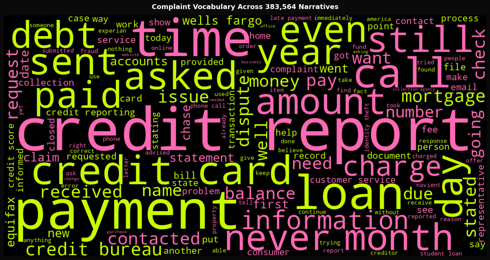
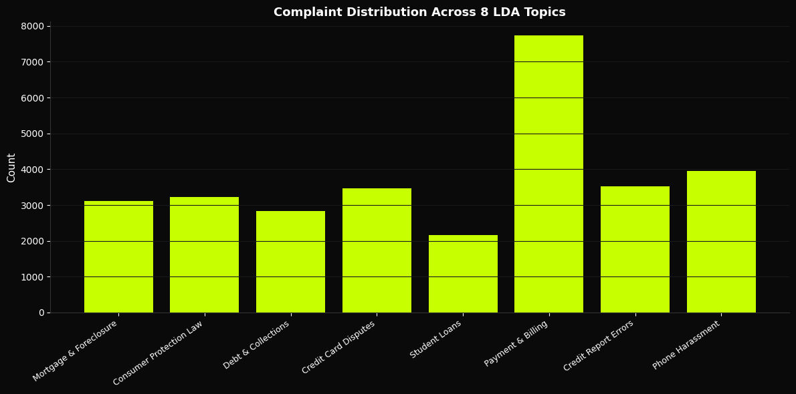
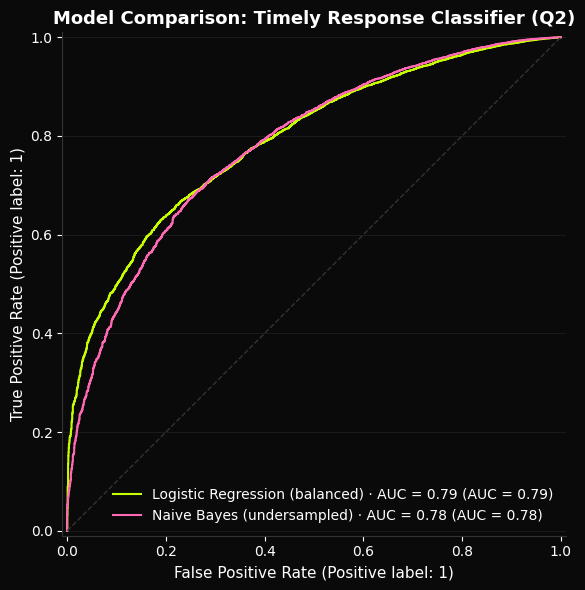

# What Do 383,000 Financial Complaints Reveal?
**LDA Topic Modeling · Logistic Regression · Word2Vec · NLP Pipeline · 383,564 Narratives**

---

## Overview

Banks, credit bureaus, and lenders receive millions of consumer complaints every year — but the richest signal is buried in free-text narratives that structured data alone cannot capture. This project applied an end-to-end NLP pipeline to the CFPB public complaint database to surface systemic patterns, predict which companies will fail to respond on time, and identify what people are actually complaining about.

Built a full pipeline from raw text to topic modeling, sentiment analysis, predictive classification, and advanced NLP (Word2Vec, zero-shot classification, abstractive summarization).

> Full write-up: https://jasminebahremand.my.canva.site/

---

## Key Findings

- **Complaint text predicts untimely responses at 79% accuracy (ROC-AUC: 0.79)** — catching 66% of at-risk cases before a deadline passes
- **The predictive signal is entity-driven, not emotional** — which company is named matters more than how angry the complaint sounds
- **Customer service failure was the dominant zero-shot complaint label** — most grievances are process breakdowns, not product failures
- **Equifax, TransUnion, and Bank of America** appeared most frequently across 383,564 narratives, pointing to where systemic issues concentrate
- **LDA identified 8 distinct complaint themes** mapping cleanly onto product categories — Payment & Billing dominated the corpus

---

## Key Visuals

### Complaint Vocabulary Across 383,564 Narratives

The most frequent terms reflect credit reporting, debt collection, and mortgage complaints — vocabulary is highly product-specific, enabling automated complaint routing.

### Model Comparison: Timely Response Classifier

Logistic Regression (AUC=0.79) outperforms Naive Bayes (AUC=0.78) — and more importantly, captures 66% of untimely cases vs 10% for NB, the metric that matters for flagging at-risk complaints.

### Complaint Distribution Across 8 LDA Topics

Payment & Billing dominates the corpus. Topic modeling surfaces the thematic structure of complaints without any labeled training data.

### Words Predicting Timely vs Untimely Response

Top predictive features are company names — confirming the signal is about who is being complained about, not what is being said.

---

## Methods

- Text preprocessing with custom stopword removal and XXXX redaction handling
- Word frequency, Zipf's Law validation, TF-IDF by product category
- N-gram analysis (bigrams and trigrams)
- LDA Topic Modeling (8 topics, 30K sample)
- VADER Sentiment Analysis by product, state, and timely response
- Binary classification — Logistic Regression (class_weight=balanced) vs Naive Bayes (undersampled, 10:1 ratio)
- Word2Vec embeddings (23,375 word vocabulary) with t-SNE visualization
- Zero-shot classification via BART-MNLI (facebook/bart-large-mnli)
- Abstractive summarization via BART-CNN (facebook/bart-large-cnn)
- spaCy NER and POS tagging across 2,000 complaint sample

---

## Tech Stack

Python · Pandas · Scikit-learn · NLTK · spaCy · Gensim · Transformers · WordCloud · Matplotlib · Seaborn

---

## How to Run

```bash
pip install -r requirements.txt
jupyter notebook cfpb.ipynb
```

Or open directly in Google Colab — upload `CFPB.csv` to `/content/` before running.

---

## Data

**CFPB Consumer Complaint Database (2015–2019):** https://www.kaggle.com/datasets/selener/consumer-complaint-database

- 383,564 complaint narratives with text
- 18 financial product types
- 4,121 unique companies
- 97/3 timely vs untimely response split

> Dataset not included in this repo due to size. Download from Kaggle and upload as `CFPB.csv`.

---

## Files

- `cfpb.ipynb` — full analysis notebook
- `requirements.txt` — dependencies
- `plots/` — generated visualizations
