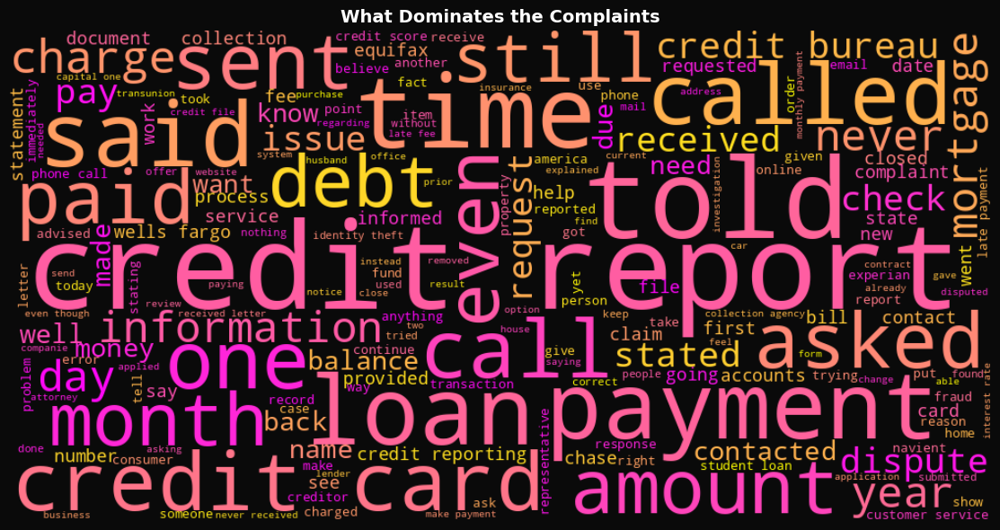
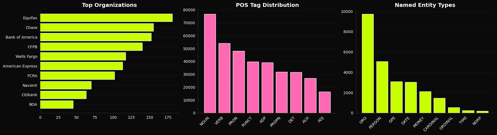
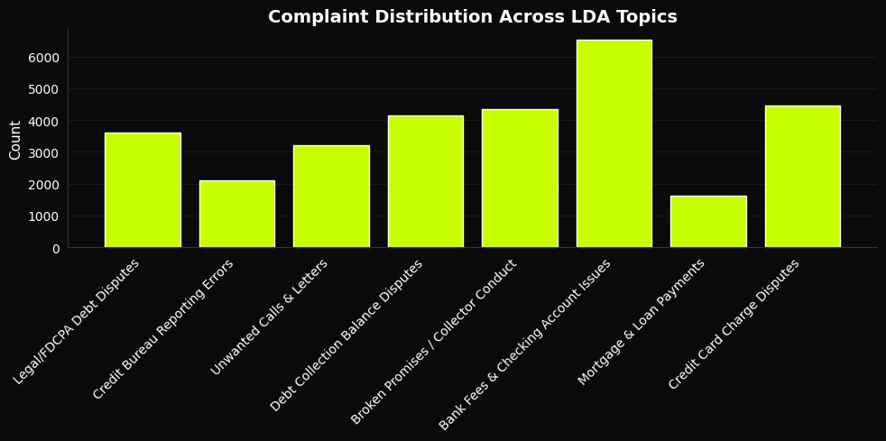
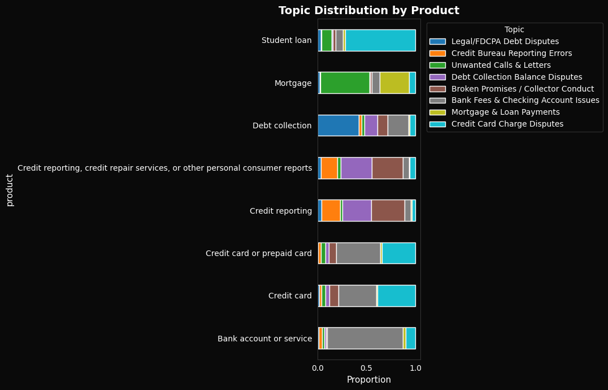

# What Do 383,000 Financial Complaints Reveal?
**LDA Topic Modeling · Logistic Regression · Word2Vec · NLP Pipeline · 383,564 Narratives**

---

## Overview
Banks, credit bureaus, and lenders receive millions of consumer complaints every year — but the richest signal is buried in free-text narratives that structured data alone cannot capture. This project applied an end-to-end NLP pipeline to the CFPB public complaint database to surface systemic patterns, predict which companies will fail to respond on time, and identify what people are actually complaining about.

> Full write-up: https://jasminebahremand.my.canva.site/

---

## Key Findings
- **Complaint text predicts untimely responses at ROC-AUC 0.76** (time-ordered split) — catching 63% of at-risk cases before a deadline passes
- **Which company is named is one of the strongest late-response signals** — though tone isn't irrelevant: emotionally charged words like "fighting" also rank among the top predictive features
- **Customer service failure was the top zero-shot label** (29% of a 300-complaint sample) — most grievances are process breakdowns, not product failures
- **In a 2,000-complaint NER sample, Equifax, Chase, and Bank of America were named most often** — pointing to where systemic issues concentrate
- **LDA identified 8 distinct, nameable complaint themes** — "Bank Fees & Checking Account Issues" was the single largest, and three separate debt-collection-related themes (legal disputes, balance disputes, collector conduct) collectively formed the largest cluster, while credit bureau reporting errors were comparatively rare as a standalone theme
- **Debt collection and banking complaints run angriest, credit card complaints run calmest** — sentiment (VADER) varies systematically by product, not just by individual complaint

---

## Key Visuals

### Complaint Vocabulary Across 383,564 Narratives

The most frequent terms (credit, report, called, paid, debt) reflect both the process of filing a complaint and its subject matter — a mix of universal complaint language and product-specific terms like "mortgage" and "equifax."

### Named Entities: Who Gets Named, and How

In a 2,000-complaint sample, Equifax, Chase, and Bank of America were the most frequently named organizations. Nouns and verbs dominate the part-of-speech distribution, and "ORG" is by far the most common entity type — consistent with complaints being structured around naming a company and describing what happened.

### Model Comparison: Timely Response Classifier

Naive Bayes edges out a marginally higher AUC (0.77 vs. 0.76), but Logistic Regression is the better real-world choice — at the deployment threshold it catches 63% of untimely responses vs. just 7% for Naive Bayes, whose undersampled training skews its probability scores.

### Complaint Distribution Across 8 LDA Topics

"Bank Fees & Checking Account Issues" is the single largest theme; three separate debt-related topics (legal disputes, balance disputes, collector conduct) collectively account for more complaints than any other category — topic modeling surfaces this structure without any labeled training data.

### Topic Themes by Product Category

Topic labels don't map onto products the way you'd expect: credit reporting complaints lean more on debt-collection-related topics (balance disputes, collector conduct) than on the dedicated "reporting errors" topic, and credit card complaints cluster mostly under "Bank Fees & Checking Account Issues" rather than "Credit Card Charge Disputes" — a reminder that unsupervised topics group by *how* people describe a problem, not just the product label attached to it.

### Which Products Complain Angriest?

Debt collection and banking complaints skew most negative in tone, while credit card and credit reporting complaints run comparatively calm — sentiment tracks the product itself, not just the individual complaint.

### Semantic Similarity Between Categories (Word2Vec)

Credit reporting and debt collection sit close in embedding space while mortgage stands apart — confirming the themes are semantically real.

---

## Methods
- Text preprocessing with custom stopword removal and XXXX redaction handling
- Word frequency, Zipf's Law validation, TF-IDF by product category, n-grams
- LDA Topic Modeling (8 topics, 30K sample)
- VADER Sentiment Analysis by product, state, and timely response
- Binary classification — Logistic Regression (class_weight=balanced) vs Naive Bayes (undersampled 10:1), TF-IDF features, time-ordered split
- Word2Vec embeddings (30K-word vocabulary) with cosine similarity + t-SNE
- Zero-shot classification via BART-MNLI; abstractive summarization via BART-CNN
- spaCy NER and POS tagging (2,000-complaint sample)

---

## Tech Stack
Python · Pandas · Scikit-learn · NLTK · spaCy · Gensim · Transformers · WordCloud · Matplotlib · Seaborn

---

## How to Run
Open `cfpb_nlp_.ipynb` in Google Colab and **Run All** — the notebook downloads the dataset automatically from a public link, so no manual upload is needed.

Locally:
```bash
pip install -r requirements.txt
jupyter notebook cfpb_nlp_.ipynb
```

---

## Data
**CFPB Consumer Complaint Database (2015–2019)** — public. Source: https://www.kaggle.com/datasets/selener/consumer-complaint-database
- 383,564 complaint narratives with text
- 18 financial product types · 4,121 unique companies
- 97 / 3 timely vs untimely response split

> The notebook pulls a hosted copy automatically; no manual download needed to run it.

---

## Files
- `cfpb_nlp_.ipynb` — full analysis notebook
- `requirements.txt` — dependencies
- `plots/` — generated visualizations
